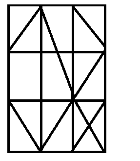
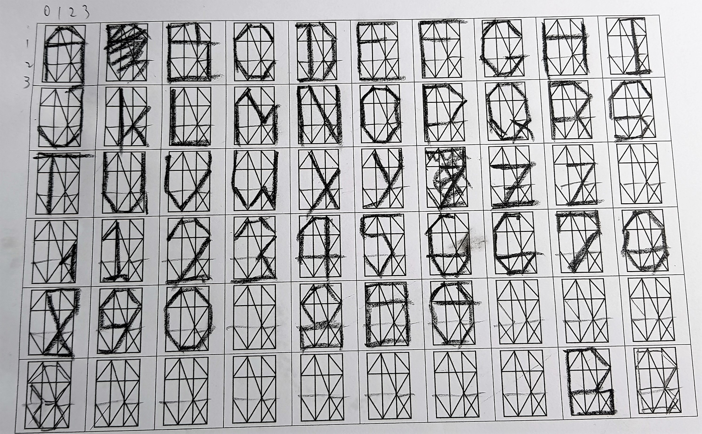
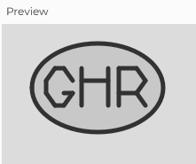

# 1. Abstract Art Logo
The objective of this milestone is to find an abstract logo that you like and draw it in P5.js. Sharpen your visual senses, make the first steps in Processing, and put your programming muscle memory to work.
1. Become familiar with the P5.js web editor
2. Research ideas for a suitable Logo
3. Sketch a suitable Logo
   
   I thought of the idea of a logo for "Grantham Hall Research" based on the letters *GHR*
   
   These could be constructed from line segments like a 7-segment display.
   
   Using a 3 by 3 grid with a 3:2 aspect ratio (shown below)
   
   _segment grid style_
   
   I came up with the following sketch for a character set:
   _Line Segment Characters Set sketch_
   
4. Break the Logo into dominant visual layers
   
   Each segment or group of segments could be a separate layer...
   
   Plus a surrounding container (say... an oval shape) with a colour filled background
   
5. Draw each layer in P5.js web editor canvas
   [This P5.js Web Editor script](GHR_logo_p5_js.txt) was developed to display the basic logo outline shown below:
   _GHR Logo Basic Outline_

## <<< [BACK TO MENU](../README.md) <<<