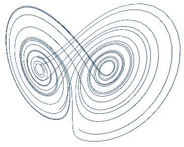
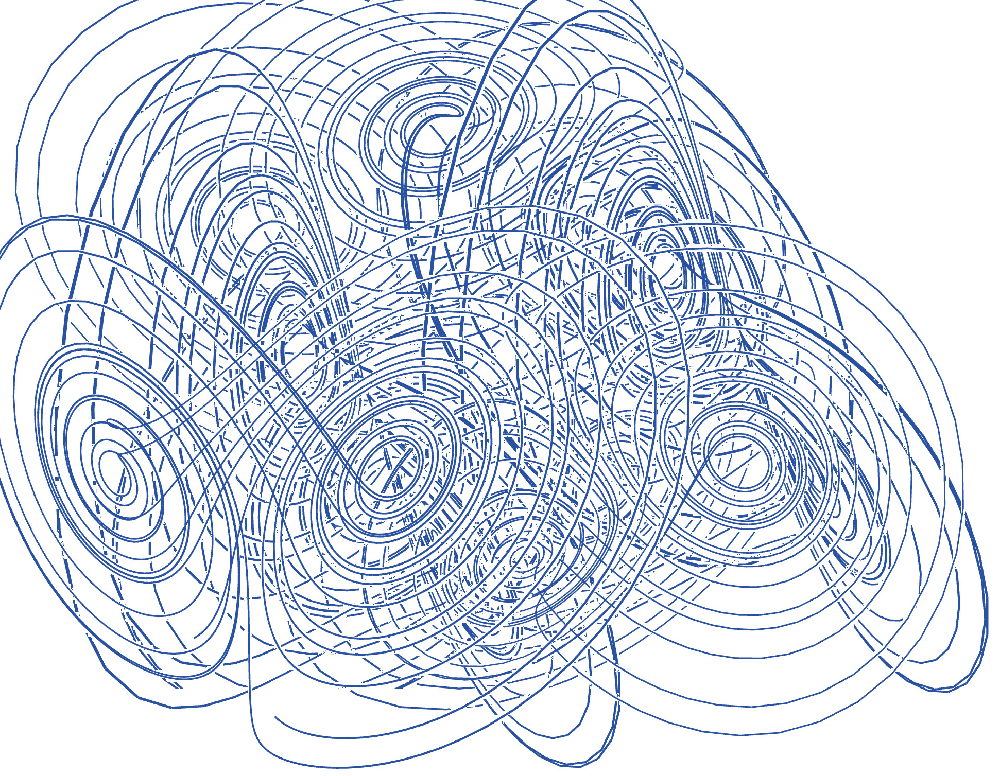
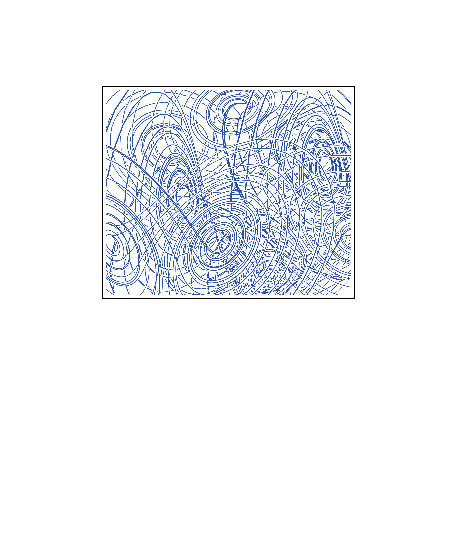

# 2. Contemporary Visual Art

## 1.  Select your inspiration
a contemporary art piece that you like and want to use in this exercise.

I found a print called *nevis-letter* by Brice Marden at ArtSpace.com, that might be repeatable using constrained random walk methods...

_https://www.artspace.com/brice_marden/nevis-letter_

## 2.  Design layers for all the visual elements
from the selected artwork and reconstruct your code according to the layers you design.

Layers will include several overlayed random walks (each in a different colour and stroke width) on one or more backgrounds.
After a lot of internet trawling, we found a P5js graphics website by Juan Carlos Ponce Campuzano, (15-Aug-2018) describing various *strange attractor* formulations at [https://www.dynamicmath.xyz/strange-attractors/](https://www.dynamicmath.xyz/strange-attractors/) and was able to capture a number of sketches like this:

The P5.js code used to achieve this may be found at [https://editor.p5js.org/skyblue38/sketches/eurN61oWNn](https://editor.p5js.org/skyblue38/sketches/eurN61oWNn)

## 3.  Finalize the drawing.
Check your code and improve the code towards a clear and readable structure. This will make it easier for others to give your feedback and recommendations.
Check the colors, shapes, positions, and proportional sizes of all the visual elements you just draw on your canvas and adjust as close as possible to the original art piece.

We tried superimposing several sketches of Lorenz Attractors and got this:

## 4.  Render the drawing and get feedback.
Render this artwork as an image file from P5.js!
Get feedback.

The sketch was cropped and rendered as shown below:

This could be improved by making the lines thinner and translucent, or by drawing in varying shades of grey (instead of monochrome blue). then moving the whorls from the many overlapping Lorenz Attractor sketches so that they correspond with more of the shapes in the original by Brice Marden...

## <<< [BACK TO MENU](../README.md) <<<